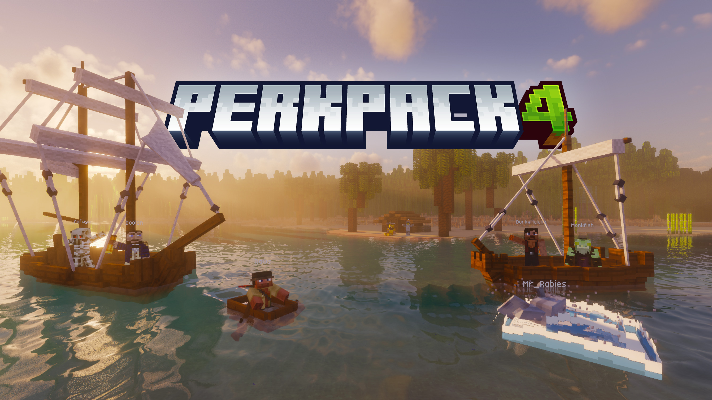
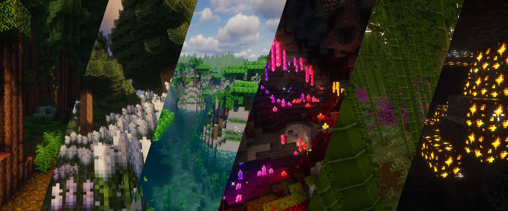
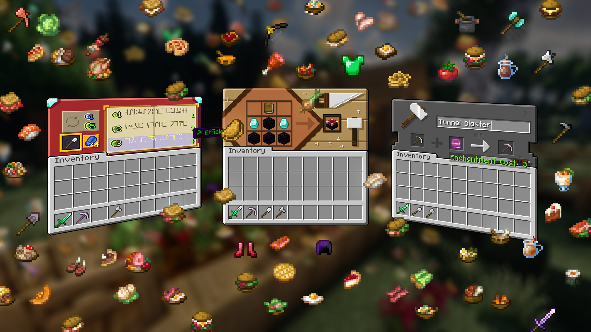
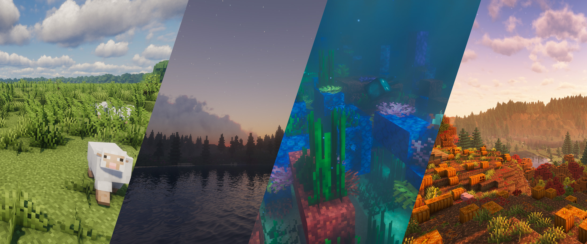

### Contents

* [Overview](#welcome-to-perkpack-4)
* [Versions](#versions)
* [How to play](#how-to-play)
  * [Helpful tips](#helpful-tips)
* [Resource packs](#resource-packs)
* [Shader packs](#shader-packs)
* [Mods](#mods)
  * [Aesthetic](#aesthetic)
  * [Quality of life](#quality-of-life)
  * [Tools](#tools)
  * [Farming](#farming)
  * [Getting around](#getting-around)
  * [World generation](#world-generation)
  * [Performance](#performance)

## Welcome to Perkpack 4!

Perkpack 4 is a major Perkpack update, based on Minecraft 1.21 ("Tricky Trials"), which was released in summer 2024. Compared to [Perkpack 3](../perkpack/README.md), which focused on industry and automation, Perkpack 4's goal is to be a relaxing survival building and exploration experience.

There are no tech trees to master, nor an intimidating number of new blocks to choose from. Instead, a slew of [visual](#aesthetic), [interface](#resource-packs), and [quality of life](#quality-of-life) tweaks make Perkpack 4 feel like a fresh game, and explorers have more than [200 new biomes](#world-generation) to discover.

Ore veins are [rarer, but larger](https://modrinth.com/datapack/larger-ore-veins-deluxe), so when you do discover one, it can keep you supplied for longer. There are [better horses](https://modrinth.com/mod/horsebuff), [horse-drawn carts](https://modrinth.com/mod/niftycarts) and [ships](https://modrinth.com/mod/small-ships) with which to explore the world, [more meals](#farming) to keep you fed, and [gravestones](https://modrinth.com/mod/pneumono_gravestones) to keep your stuff safe when you die. Craft special compasses that can point you toward any [biome](https://modrinth.com/mod/natures-compass) or [structure](https://modrinth.com/mod/explorers-compass) you want to find. [Chalk](https://modrinth.com/mod/chalk) helps you mark your path through caves.

Every screen has been [redesigned to look unique](https://www.curseforge.com/minecraft/texture-packs/colourful-containers-gui). You can leave items on [anvils](https://modrinth.com/mod/easy-anvils) and [enchanting tables](https://modrinth.com/mod/easy-magic) and come back to them later. Tool repair and enchantment cost no longer increases over time. You can sneak + right-click an item enchanted with Mending to [repair it using experience from your XP bar](https://modrinth.com/mod/better-than-mending). The enchanting table has a re-roll button to easily re-roll available enchantments.

You can craft tools and armor out of [copper, emeralds, and amethyst](https://www.curseforge.com/minecraft/mc-mods/simple-emerald-tools-fabric) to bridge the gap between iron and diamond. You can also craft hammers that mine 3x3 stone, excavators that mine 3x3 dirt, and tree axes that fell entire trees at once, so you can spend less time mining and more time building, if you want to.

Sound like fun? See below for [how to play](#how-to-play)! And remember to always mine straight down ⛏️

If you're new to Minecraft 1.21 and haven't kept up with Minecraft news, you might want to peruse the big changes in the last few major game updates:

* [1.20 "Trails & Tails" update guide](https://minecraft.wiki/w/Java_Edition_guides/Trails_%26_Tales)
* [1.20.5 "Armored Paws" update guide](https://minecraft.wiki/w/Java_Edition_guides/Armored_Paws)
* [1.21 "Tricky Trials" update guide](https://minecraft.wiki/w/Java_Edition_guides/Tricky_Trials)

## Versions

Perkpack bumps its major version number for each significant Minecraft update (e.g. from Minecraft 1.20 to 1.21).

| | Perkpack Version     | Minecraft Version | Java Version |
|-|----------------------|-------------------|--------------|
|  | Perkpack 4 (current) | [Minecraft 1.21](https://minecraft.wiki/w/Java_Edition_1.21) | Java 21 |
|  | [Perkpack 3](../perkpack/README.md) | [Minecraft 1.20](https://minecraft.wiki/w/Java_Edition_1.20) | Java 17 |
|  | Perkpack 2 | [Minecraft 1.18](https://minecraft.wiki/w/Java_Edition_1.18) | Java 17 |
|  | Perkpack 1 | [Minecraft 1.17](https://minecraft.wiki/w/Java_Edition_1.17) | Java 17 |

As described in ["How to play"](#how-to-play), below, the mod pack automatically keeps itself up to date once you've installed it. If you're interested in the changes between versions, you can find release notes here: https://github.com/blolol/minecraft-mod-packs/releases

Mod pack updates are also announced by Wheaties in the `#minecraft` channels of [Blolol's IRC and Discord servers](https://blolol.com/chat).

## How to play

Playing Perkpack 4 is, like Perkspack prior, pretty simple stuff. You'll only need to install the mod pack once. It will otherwise automatically keep itself up to date.

1. Install [Prism Launcher](https://prismlauncher.org). <small>**Note:** Prism Launcher 9.0 and newer automatically manages Java installations for you, similar to Mojang's official Minecraft launcher. If you're using an older version of Prism, you should update to the latest release! Otherwise, you'll need to [install Java 21](https://prismlauncher.org/wiki/getting-started/installing-java/) yourself, and make sure Prism is configured to use it.</small>
1. In Prism Launcher, click "Add Instance", then "Import".
1. Give the instance a name like "Perkpack 4", then paste in this URL: https://github.com/blolol/minecraft-mod-packs/raw/main/packs/perkpack-4/prism-instance.zip
1. Once you're in-game, click on Multiplayer and connect to the Perkpack 4 server that should already be in the list. (If you accidentally delete it, the server address is `mc.blolol.com`.)

### Helpful tips

* **Borderless windowed mode:** In video settings, you can toggle "Fullscreen" to "Borderless", thanks to [Cubes Without Borders](https://modrinth.com/mod/cubes-without-borders).
  * :warning: As of September 21, 2024, there is [a known issue](https://github.com/Kir-Antipov/cubes-without-borders/issues/30) where the "Fullscreen" option in [Sodium](https://modrinth.com/mod/sodium)'s video settings sometimes appears as a checkbox, instead of as a labeled button that can toggle between "Fullscreen" and "Borderless". If this happens for you, you can press <kbd>Shift</kbd> + <kbd>P</kbd> to display the vanilla video settings screen, where the button should work as expected.
* **Shaders:** Press <kbd>O</kbd> to choose a shader pack, and <kbd>K</kbd> to toggle them on and off. Perkpack 4 includes [several shaderpacks](#shaders) that are designed to work with [Distant Horizons](https://modrinth.com/mod/distanthorizons).
* **Zooming:** Press <kbd>C</kbd> and use your mouse wheel to zoom using the [Ok Zoomer](https://modrinth.com/mod/ok-zoomer) mod.
* **Maps:** You can mix and match a minimap on your HUD and a full-screen world map. Both are highly configurable.
  * Press <kbd>M</kbd> to open [Xaero's World Map](https://modrinth.com/mod/xaeros-world-map).
  * Press <kbd>N</kbd> to toggle [Xaero's Minimap](https://modrinth.com/mod/xaeros-minimap).
* **[Jade](https://modrinth.com/mod/jade)** can show you details about the block or entity you're looking at. Press <kbd>1</kbd> on your numpad to toggle it.
* **[Auto run](https://modrinth.com/mod/autorun)** not only works for running with your own two legs, but also with boats, horses, and other mounts. Press <kbd>`</kbd> (backtick) to toggle it.
* **Sorting inventories:** [Keep Inventories Sorted, Simple](https://modrinth.com/mod/kiss) (KISS) comes with the mod pack, but is disabled by default, to avoid adding potentially confusing keybinds and buttons to the UI. If you want to be able to quickly sort inventories, you can bind a key to "Sort Inventory" in Options > Controls > Key Binds. (A common choice is <kbd>R</kbd>.) You can also enable a sort button on inventory screens in Mods > "Keep Inventories Sorted, Simple" > Config.
* **Bushy leaves:** If you prefer cubic leaves to the bushier versions that come with the mod pack, go to Options > Resource Packs, and disable the "Better Leaves" and "Bushy Leaves Compat" resource packs.
* Want to **chop down entire trees at once, or dig out 3x3 areas?** Check out the special tools added by [Easy Emerald Tools & More](https://www.curseforge.com/minecraft/mc-mods/simple-emerald-tools-fabric). To easily see all of the available items and their recipes in-game, type `@emerald` (or any other part of the mod name) into [EMI](https://modrinth.com/mod/emi)'s search bar in your inventory screen to filter the list to items added by the mod. Left-click on any item to see its recipe.
* **[Horse Buff](https://modrinth.com/mod/horsebuff)** prevents saddled horses from wandering, so you don't need to carry a lead and a fence post. Horses also no longer sink in water, so you can swim across rivers without dismounting. There are a couple of other useful features as well; check the mod's page for details.

## Resource packs

* [3D Crops Revamped](https://modrinth.com/resourcepack/3d-crops)
* [Colourful Containers](https://www.curseforge.com/minecraft/texture-packs/colourful-containers-gui)
* [Compact Font](https://modrinth.com/resourcepack/compact-font)
* [Door Tweaks](https://modrinth.com/resourcepack/door-tweaks)
* [Enchant Icons](https://modrinth.com/resourcepack/enchant-icons-countxd)
* [Enchanted Covers](https://modrinth.com/resourcepack/enchanted-covers)
* [Fast Better Grass](https://modrinth.com/resourcepack/fast-better-grass)
* [Fresh Animations](https://modrinth.com/resourcepack/fresh-animations)
* [Fresh Animations Extensions](https://modrinth.com/resourcepack/fresh-animations-extensions)
* [Motschen's Better Leaves](https://modrinth.com/resourcepack/better-leaves)
* [Ray's 3D Ladders](https://modrinth.com/resourcepack/rays-3d-ladders)
* [Ray's 3D Rails](https://modrinth.com/resourcepack/rays-3d-rails)
* [Vanilla Tweaks](https://vanillatweaks.net/)

## Shader packs

These shader packs are designed to work with [Distant Horizons](https://modrinth.com/mod/distanthorizons)' ultra-long view distances. You can also [install your own](https://modrinth.com/shaders), if you prefer a different look!

* [BSL](https://modrinth.com/shader/bsl-shaders)
* [Complementary Unbound](https://modrinth.com/shader/complementary-unbound)
* [Photon](https://modrinth.com/shader/photon-shader)

## Mods

### Aesthetic

* [3D Skin Layers](https://modrinth.com/mod/3dskinlayers)
* [AmbientSounds](https://modrinth.com/mod/ambientsounds)
* [Better Clouds](https://modrinth.com/mod/better-clouds)
* [Better Lanterns](https://modrinth.com/resourcepack/better-lanterns)
* [Boids](https://modrinth.com/mod/boids)
* [Chat Heads](https://modrinth.com/mod/chat-heads)
* [Continuity](https://modrinth.com/mod/continuity)
* [Eating Animation](https://modrinth.com/mod/eating-animation)
* [Falling Leaves](https://modrinth.com/mod/fallingleaves)
* [Glowing Torchflower](https://modrinth.com/mod/glowing-torchflower)
* [ImmersiveThunder](https://modrinth.com/mod/immersivethunder)
* [Not Enough Animations](https://modrinth.com/mod/not-enough-animations)
* [Particular](https://modrinth.com/mod/particular)
* [Smooth Scrolling](https://modrinth.com/mod/smooth-scroll)
* [Sound Physics Remastered](https://modrinth.com/mod/sound-physics-remastered)
* [Sounds](https://modrinth.com/mod/sound)
* [Tiny Item Animations](https://modrinth.com/mod/tiny-item-animations)
* [Visuality](https://modrinth.com/mod/visuality)
* [Wakes](https://modrinth.com/mod/wakes)

### Quality of life

* [AppleSkin](https://modrinth.com/mod/appleskin)
* [AutoRun](https://modrinth.com/mod/autorun) (press <kbd>`</kbd> to autorun)
* [Better Advancements](https://modrinth.com/mod/better-advancements)
* [Better Statistics Screen](https://modrinth.com/mod/better-stats)
* [Better Than Mending](https://modrinth.com/mod/better-than-mending) (sneak + right-click to use XP to fix your Mending-enchanted tools)
* [BetterF3](https://modrinth.com/mod/betterf3)
* [Bridging Mod](https://modrinth.com/mod/bridging-mod) (reach-around block placement)
* [Cubes Without Borders](https://modrinth.com/mod/cubes-without-borders) (borderless fullscreen mode)
* [Durability Tooltip](https://modrinth.com/mod/durability-tooltip)
* [Easy Anvils](https://modrinth.com/mod/easy-anvils) (items remain on anvils, better nametags, many tweaks)
* [Easy Magic](https://modrinth.com/mod/easy-magic) (items remain on enchanting tables, easy re-rolls)
* [Easy Shulker Boxes](https://modrinth.com/mod/easy-shulker-boxes) (use shulker boxes directly from your inventory)
* [EMI](https://modrinth.com/mod/emi) (item and recipe viewer)
* [Gravestones](https://modrinth.com/mod/pneumono_gravestones) (if you die, your stuff is saved in a gravestone)
* [Held Item Info](https://modrinth.com/mod/held-item-info) (shows useful information about the selected item in your hotbar)
* [Item Placer](https://modrinth.com/mod/item-placer) (press <kbd>V</kbd> to place an item on any surface of a block; rotate with opt/alt + mouse wheel; right-click to pick the item back up)
* [Keep Inventories Sorted, Simple](https://modrinth.com/mod/kiss) (disabled by default to avoid confusion; if you want to be able to quickly sort inventories, bind a key to "sort inventory" and/or enable the sort button in the mod's settings)
* [Leaves Be Gone](https://modrinth.com/mod/leaves-be-gone) (quick leaf decay)
* [Mouse Tweaks](https://modrinth.com/mod/mouse-tweaks) (move items between inventories with your scroll wheel)
* [Ok Zoomer](https://modrinth.com/mod/ok-zoomer) (press <kbd>C</kbd> and your mouse wheel to zoom)
* [Pick Up Notifier](https://modrinth.com/mod/pick-up-notifier) (be notified of all the things you've just collected)
* [Jade](https://modrinth.com/mod/jade) (press <kbd>1</kbd> on your numpad to toggle a HUD that shows details about the block or entity you're looking at)
* [Shulker+](https://modrinth.com/mod/shulker+) (label your shulker boxes with items and easily dye them)
* [Symbol Chat](https://modrinth.com/mod/symbol-chat)
* [Toggle Item Frames](https://modrinth.com/mod/toggle-item-frames) (sneak + right-click an item frame to make it invisible)
* [Xaero's Minimap](https://modrinth.com/mod/xaeros-minimap) (press <kbd>N</kbd> to toggle a minimap)
* [Xaero's World Map](https://modrinth.com/mod/xaeros-world-map) (press <kbd>M</kbd> to toggle a full-screen world map)

### Tools

* [Chalk](https://modrinth.com/mod/chalk) and [Chalk: Colorful Addon](https://modrinth.com/mod/chalk-colorful-addon) (mark your way through the world with colored chalk)
* [Comforts](https://modrinth.com/mod/comforts) (craft a sleeping bag to skip the night without setting your respawn point)
* [Easy Emerald Tools & More](https://www.curseforge.com/minecraft/mc-mods/simple-emerald-tools-fabric) (sets of armor, tools and weapons between vanilla iron and diamond, and 3x3 mining tools; finally a use for all of that copper!)
* [Explorer's Compass](https://modrinth.com/mod/explorers-compass) (a compass that points you toward a structure of your choice)
* [Extended Drawers](https://modrinth.com/mod/extended-drawers) (an alternative to chests for organization freaks)
* [Nature's Compass](https://modrinth.com/mod/natures-compass) (a compass that points you toward a biome of your choice)
* [NiftyCarts](https://modrinth.com/mod/niftycarts) (carts for travel, shipping and farming)

### Farming

Farmer's Delight gently expands upon Minecraft's farming and cooking experience with new crops and many new tasty meals. You can follow the in-game advancements (<kbd>L</kbd>) to learn how to play, or consult [its wiki](https://github.com/vectorwing/FarmersDelight/wiki/Getting-Started).

* [Farmer's Cutting: Biomes O' Plenty](https://modrinth.com/datapack/farmers-cutting-biomes-o-plenty)
* [Farmer's Delight](https://modrinth.com/mod/farmers-delight-refabricated)
* [More Delight](https://modrinth.com/mod/more-delight)

### Getting around

* [Horse Buff](https://modrinth.com/mod/horsebuff) (quality of life tweaks for horses)
* [Small Ships](https://modrinth.com/mod/small-ships) (need a seagoing vessel larger than a rowboat?)

### World generation

* [Biomes O' Plenty](https://modrinth.com/mod/biomes-o-plenty)
* [Dungeons and Taverns](https://modrinth.com/datapack/dungeons-and-taverns)
* [Explorify](https://modrinth.com/datapack/explorify)
* [Larger Ore Veins: Deluxe](https://modrinth.com/datapack/larger-ore-veins-deluxe)
* [Lithosphere](https://modrinth.com/datapack/lithosphere)
* [Nature's Spirit](https://modrinth.com/mod/natures-spirit)
* [Regions Unexplored](https://modrinth.com/mod/regions-unexplored)
* [Tidal Towns](https://modrinth.com/datapack/tidal-towns)

### Performance

* [Chunky](https://modrinth.com/plugin/chunky)
* [Concurrent Chunk Management Engine](https://modrinth.com/mod/c2me-fabric)
* [Distant Horizons](https://modrinth.com/mod/distanthorizons)
* [Entity Model Features](https://modrinth.com/mod/entity-model-features) (EMF)
* [Entity Culling](https://modrinth.com/mod/entityculling)
* [Entity Texture Features](https://modrinth.com/mod/entitytexturefeatures) (ETF)
* [FerriteCore](https://modrinth.com/mod/ferrite-core)
* [ImmediatelyFast](https://modrinth.com/mod/immediatelyfast)
* [Indium](https://modrinth.com/mod/indium)
* [Iris](https://modrinth.com/mod/iris)
* [Lithium](https://modrinth.com/mod/lithium)
* [Noisium](https://modrinth.com/mod/noisium)
* [Reese's Sodium Options](https://modrinth.com/mod/reeses-sodium-options)
* [Sodium Extra](https://modrinth.com/mod/sodium-extra)
* [Sodium](https://modrinth.com/mod/sodium)

## Development

Like Perkpack 3, Perkpack 4 is managed using [packwiz](https://github.com/packwiz/packwiz), so you can refer to `../perkpack/README.md` for further documentation.
