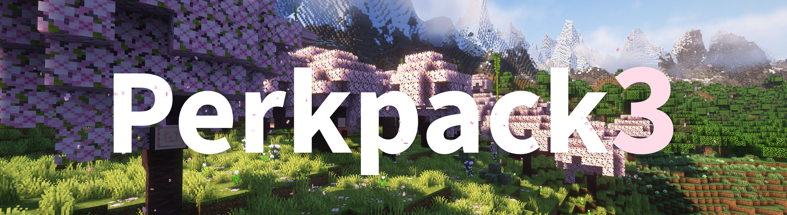

# Perkpack 3

Perkpack is Blolol's Minecraft mod pack, used for blocky shenanigans on our Minecraft server!

## Versions

Perkpack bumps its major version number for each significant Minecraft update (e.g. from Minecraft 1.18 to 1.19).

| Perkpack Version     | Minecraft Version |
|----------------------|-------------------|
| Perkpack 3 (current) | Minecraft 1.20    |
| Perkpack 2           | Minecraft 1.18    |
| Perkpack 1           | Minecraft 1.17    |

As described in ["How to play"](#how-to-play), below, the mod pack automatically keeps itself up to date once you've installed it. If you're interested in the changes between versions, you can find release notes here: https://github.com/blolol/minecraft-mod-packs/releases

Mod pack updates are also announced by Wheaties in the `#minecraft` channels of [Blolol's IRC and Discord servers](https://blolol.com/chat).

## How to play

Playing Perkpack is pretty simple stuff. You'll only need to install the mod pack once per significant Minecraft update (e.g. from Minecraft 1.19 to 1.20). It will otherwise automatically keep itself up to date.

> [!IMPORTANT]
> **If you already have Prism Launcher installed, make sure you're running version 7.2 or newer.** Earlier versions may fail to launch the mod pack and show an error like "The process failed to start. Pre-Launch command failed with code 0."

1. Install [Java](https://prismlauncher.org/wiki/getting-started/installing-java/).
1. Install [Prism Launcher](https://prismlauncher.org).
1. In Prism Launcher, click "Add Instance", then "Import".
1. Give the instance a name like "Perkpack 3", then paste in this URL: https://github.com/blolol/minecraft-mod-packs/raw/perkpack/3/packs/perkpack/prism-instance.zip
1. Once you're in-game, connect to `mc.blolol.com`.


## Mods

### Create

Perkpack is built around [Create](https://modrinth.com/mod/create-fabric). Create adds a variety of blocks and tools with which you can build mechanical contraptions to automate and decorate your world—think conveyer belts, steam engines, mechanical presses, automated train networks, and much more.

<details>
  <summary>
    Click to expand more about Create
  </summary>

  To get an idea of what's possible with Create, check out its trailer:

  [](https://www.youtube.com/watch?v=rR8W-f9YhYA)

  Create features interactive, in-game documentation using a system called "Ponder". To try it out, open up your inventory and filter it to Create's blocks and items by typing `@create` into the search bar. Find a block or item with "Hold [w] to ponder" in its tooltip to view its animated tutorial:

  

  There's also [a well-maintained wiki](https://create.fandom.com/wiki/Create_Mod_Wiki) and lots of Create content on YouTube!
</details>

### New content

* [Amendments](https://modrinth.com/mod/amendments) (lanterns on walls, display items on hanging signs, more cauldron features, hang banners and pots from ceilings, and more)
* [Chipped](https://modrinth.com/mod/chipped) (thousands of building block variants)
* [Chunk Loaders](https://modrinth.com/mod/chunk-loaders) (keep chunks loaded when you're not around)
* [Create: Bells & Whistles](https://modrinth.com/mod/bellsandwhistles) (decorative blocks for trains, like cowcatchers, headlights and ladders)
* [Create: Copycats+](https://modrinth.com/mod/copycats) (Create copycat blocks in more shapes)
* [Create: Deco](https://www.curseforge.com/minecraft/mc-mods/create-deco-fabric) (new Create-themed decoration blocks)
* [Create: Dreams & Desires](https://modrinth.com/mod/create-dreams-and-desires) (Create quality of life improvements and decorative blocks)
* [Create: Jetpack](https://modrinth.com/mod/create-jetpack)
* [Create: Slice & Dice](https://modrinth.com/mod/slice-and-dice) (compatibility between Create and Farmer's Delight)
* [Create: Steam 'n' Rails](https://modrinth.com/mod/create-steam-n-rails)
* [Decorative Blocks](https://modrinth.com/mod/decorative-blocks) (supports, pillars, chains, beams, braziers, chandeliers and more, oh my)
* [Dramatic Doors](https://modrinth.com/mod/dramatic-doors) (one- and three-block-tall door variants)
* [Extended Drawers](https://modrinth.com/mod/extended-drawers) (store items in drawers)
* [Farmer's Delight](https://modrinth.com/mod/farmers-delight-fabric) (gently expands upon farming and cooking)
* [Handcrafted](https://modrinth.com/mod/handcrafted) (comfy furniture and decorations)
* [Just Hammers](https://modrinth.com/mod/just-hammers) (hammers that are able to mine in 3x3x1, 3x3x3, 5x5x1, 5x5x3 and 5x5x5 areas)
* [Macaw's Bridges](https://www.curseforge.com/minecraft/mc-mods/macaws-bridges) (bridge and stair variants)
* [Macaw's Fences & Walls](https://www.curseforge.com/minecraft/mc-mods/macaws-fences-and-walls) (fence, wall and gate variants)
* [Nether Chest](https://modrinth.com/mod/nether-chest) (shared Ender Chest)
* [Supplementaries](https://modrinth.com/mod/supplementaries) and [Supplementaries Squared](https://modrinth.com/mod/supplementaries-squared) (lots of vanilla-like content; refer to [its wiki](https://github.com/MehVahdJukaar/Supplementaries/wiki))
* [Traveler's Backpack](https://modrinth.com/mod/travelersbackpack) (haul your stuff around in style)
* [Waystones](https://modrinth.com/mod/waystones) (teleport around the world)

### Quality of life

* [AdvancementInfo](https://modrinth.com/mod/advancementinfo) (nicer advancements screen)
* [Amecs](https://modrinth.com/mod/amecs) (use modifier keys in your key bindings)
* [AutoRun](https://modrinth.com/mod/autorun) (use <kbd>`</kbd> to toggle autorun)
* [BetterF3](https://modrinth.com/mod/betterf3) (more readable <kbd>F3</kbd> debug overlay)
* [Better Mount HUD](https://modrinth.com/mod/better-mount-hud) (more useful HUD while riding)
* [Building Wands](https://modrinth.com/mod/building-wands) (build quicker with magic wands)
* [Carry On](https://modrinth.com/mod/carry-on) (move chests around, pick up villagers, stack mobs on top of each other)
* [Couplings](https://modrinth.com/mod/couplings) (simultaneously open adjacent doors)
* [Create: Train Perspective](https://modrinth.com/mod/create-train-perspective) (passengers' bodies follow the orientation of Create trains)
* [EMI](https://modrinth.com/mod/emi) (item and recipe viewer)
* [EMI Trades](https://modrinth.com/mod/emitrades) (villager trades in EMI)
* [FallingTree](https://modrinth.com/mod/fallingtree) (enchant your axe to fell entire trees at once)
* [Inspecio](https://modrinth.com/mod/inspecio) (fancy tooltips for maps, shulker boxes, etc.)
* [Inventory Profiles Next](https://modrinth.com/mod/inventory-profiles-next) (inventory sorting and other related features)
* [ItemSwapper](https://modrinth.com/plugin/itemswapper) (quick item switching using <kbd>r</kbd>)
* [Magnum Torch](https://modrinth.com/mod/magnum-torch) (prevent mob spawning in a large area)
* [MiniHUD](https://www.curseforge.com/minecraft/mc-mods/minihud) (extremely customizable HUD, use <kbd>h</kbd> to toggle and </kbd>h + c</kbd> to configure)
* [Mouse Tweaks](https://modrinth.com/mod/mouse-tweaks) (nicer inventory management)
* [Ok Zoomer](https://modrinth.com/mod/ok-zoomer) (use <kbd>c</kbd> and your mouse wheel to zoom)
* [Symbol Chat](https://modrinth.com/mod/symbol-chat) (easy access to Unicode symbols when chatting, editing signs, and naming items with anvils)
* [Time Control](https://modrinth.com/mod/time-control) (customization of the day/night cycle)
* [Trade Cycling](https://modrinth.com/mod/trade-cycling) (cycle villager trades with the click of a button)
* [Trinkets](https://modrinth.com/mod/trinkets) (wear a helm and Create engineering goggles at the same time!)
* [VillagerLeads](https://modrinth.com/mod/villager-leads) (leash villagers and wandering traders)
* [WTHIT](https://modrinth.com/mod/wthit) (tells you what the hell you're looking at)
* [Yeetus Experimentus](https://modrinth.com/mod/yeetus-experimentus) (silences the experimental features warning when creating a new world)

### World generation

* [ChoiceTheorem's Overhauled Village](https://modrinth.com/mod/ct-overhaul-village) (more interesting villages)
* [Tectonic](https://modrinth.com/datapack/tectonic) (large-scale terrain)
* [Terralith](https://modrinth.com/mod/terralith) (new biomes)
* [Terrestria](https://modrinth.com/mod/terrestria) (new biomes)
* [Traverse](https://modrinth.com/mod/traverse) (new biomes)
* [YUNG's Better Desert Temples](https://modrinth.com/mod/yungs-better-desert-temples)
* [YUNG's Better Dungeons](https://modrinth.com/mod/yungs-better-dungeons)
* [YUNG's Better Jungle Temples](https://modrinth.com/mod/yungs-better-jungle-temples)
* [YUNG's Better Mineshafts](https://modrinth.com/mod/yungs-better-mineshafts)
* [YUNG's Better Nether Fortresses](https://modrinth.com/mod/yungs-better-nether-fortresses)
* [YUNG's Better Strongholds](https://modrinth.com/mod/yungs-better-strongholds)
* [YUNG's Better Witch Huts](https://modrinth.com/mod/yungs-better-witch-huts)

### Resource packs

* [Default Dark Mode](https://modrinth.com/resourcepack/default-dark-mode) (:new_moon_with_face:)
* [Fresh Animations](https://modrinth.com/resourcepack/fresh-animations) (fancy mob animations)

### Datapacks

These are not included in the mod pack, but are used on the Perkpack servers. They're documented here in case you'd like to add them to your own singleplayer worlds.

* AFK detection
  * [Detect AFK Players](https://modrinth.com/datapack/detect-afk)
  * [Pause Day Cycle](https://modrinth.com/datapack/pause-day-cycle)
  * [AFK Announce](https://github.com/clo4/detect-afk/releases/tag/v1.0.0)
  * [AFK Team](https://github.com/clo4/detect-afk/releases/tag/v1.0.0)
* Vanilla Tweaks data packs (https://vanillatweaks.net/share#kRxmuI)
  * Fast Leaf Decay
  * Track Raw Statistics
  * Track Statistics
  * Player Head Drops
  * Anti Enderman Grief
  * Anti Ghast Grief
  * Double Shulker Shells
  * Dragon Drops
  * More Mob Heads
  * Wandering Trades

### Shaders

Perkpack includes support for third-party shader packs using the [Iris]() mod. To enable and configure shaders in-game, use the default <kbd>o</kbd> key, and use <kbd>k</kbd> to toggle shaders on and off.

The pack includes these shaders by default, but you can also [install your own](https://modrinth.com/shaders):

* [BSL](https://modrinth.com/shader/bsl-shaders)
* [Complementary Reimagined](https://modrinth.com/shader/complementary-reimagined)
* [Complementary Unbound](https://modrinth.com/shader/complementary-unbound)

### Performance, bug fixes, compatibility

Perkpack includes a set of optimization mods, based on [Fabulously Optimized](https://modrinth.com/modpack/fabulously-optimized), to increase base game performance, fix a variety of bugs present in the vanilla game, and provide compatibility with OptiFine resource packs.

<details>
  <summary>
    Click to expand list of performance mods
  </summary>

  * [Animatica](https://modrinth.com/mod/animatica)
  * [Borderless Mining](https://modrinth.com/mod/borderless-mining)
  * [Capes](https://modrinth.com/mod/capes)
  * [CIT Resewn](https://modrinth.com/mod/cit-resewn)
  * [Clumps](https://modrinth.com/mod/clumps)
  * [Continuity](https://modrinth.com/mod/continuity)
  * [Debugify](https://modrinth.com/mod/debugify)
  * [Enhanced Block Entities](https://modrinth.com/mod/ebe) (EBE)
  * [Entity Model Features](https://modrinth.com/mod/entity-model-features) (EMF)
  * [Entity Culling](https://modrinth.com/mod/entityculling)
  * [Entity Texture Features](https://modrinth.com/mod/entitytexturefeatures) (ETF)
  * [Fadeless](https://modrinth.com/mod/fadeless)
  * [FerriteCore](https://modrinth.com/mod/ferrite-core)
  * [ImmediatelyFast](https://modrinth.com/mod/immediatelyfast)
  * [Indium](https://modrinth.com/mod/indium)
  * [Iris](https://modrinth.com/mod/iris)
  * [Krypton](https://modrinth.com/mod/krypton)
  * [Lithium](https://modrinth.com/mod/lithium)
  * [Memory Leak Fix](https://modrinth.com/mod/memoryleakfix)
  * [Model Gap Fix](https://modrinth.com/mod/modelfix)
  * [ModernFix](https://modrinth.com/mod/modernfix)
  * [More Culling](https://modrinth.com/mod/moreculling)
  * [Reese's Sodium Options](https://modrinth.com/mod/reeses-sodium-options)
  * [Sodium Extra](https://modrinth.com/mod/sodium-extra)
  * [Sodium](https://modrinth.com/mod/sodium)
</details>

### Server-only

These mods are only installed by default on the server. They're used for server administration.

<details>
  <summary>
    Click to expand list of server-only mods
  </summary>

* [BlueMap](https://modrinth.com/plugin/bluemap)
* [BlueMap Sign Markers](https://modrinth.com/mod/bluemap-sign-markers)
</details>

## Development

### Testing the pack

You can use [Docker Compose](https://docs.docker.com/compose/) to set up a local development environment. The included `docker-compose.yml` will:

* Start an HTTP server on port 8082 that will serve up `pack.toml` and other packwiz files.
* Start a Minecraft game server on port 25565 (the game's default) using those local pack files.

To start both servers, run `docker compose up` in this directory. Minecraft server data will be written into `tmp/server` and ignored by Git. The Docker Compose file includes defaults that will be written to `server.properties`. Once the file is generated, you can customize it.

To create a Prism Launcher instance that connects to your local HTTP server, import `prism-instance.zip` to create a new instance. Right-click on the instance and select Edit > Settings > Custom commands. Change the pre-launch command to point at your local server:

```sh
"$INST_JAVA" -jar packwiz-installer-bootstrap.jar http://localhost:8082/pack.toml
```

To learn how to contribute your changes to Perkpack, see [this repository's main README](../../README.md).

### Building `prism-instance.zip`

To build `prism-instance.zip`, run `make` in this directory. Use `make clean` to remove it.

### Building data packs

To build any of the custom data packs in `packs/perkpack/datapacks`, first change directory into the datapack's folder, then use `zip` to create an archive. This avoids creating a top-level folder within the resulting zip file, which will prevent Minecraft from identifying the data pack.

```
cd datapacks/perkpack_extended_drawers
zip -r ../perkpack_extended_drawers.zip .
```

You can also use e.g. `make datapacks/perkpack_extended_drawers.zip`.
