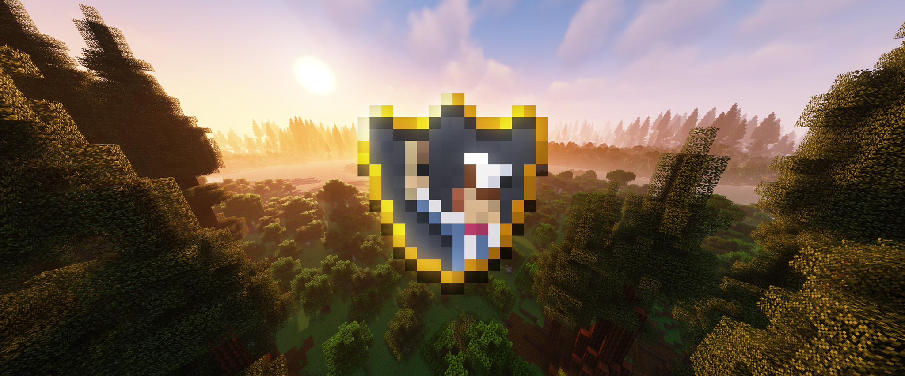
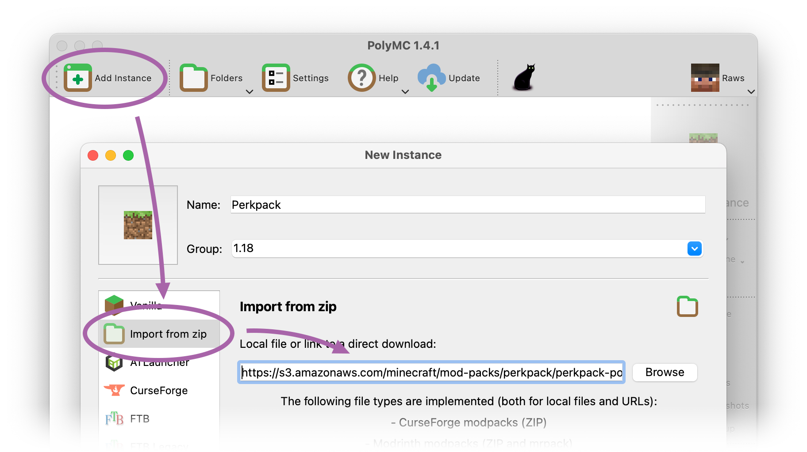

#  Perkpack

**Perkpack is Blolol's Minecraft mod pack, used for blocky shenanigans on our Minecraft server.**

It doesn't follow any particular theme, and is a reflection of the community's whims. Sometimes we might be interested in a minimalist "vanilla plus" experience, then ruthlessly strip-mining every dimension to oblivion using advanced technology, and the next world might be a hardcore survival challenge.

The current release, Perkpack 2, is based on Minecraft 1.18 and revolves around the [Create](https://www.curseforge.com/minecraft/mc-mods/create) and [MineColonies](https://www.curseforge.com/minecraft/mc-mods/minecolonies) mods. Create adds mechanical components with which you can build all kinds of animated contraptions for automation or decoration—check out [its trailer](https://www.youtube.com/watch?v=rR8W-f9YhYA) to get an idea of what's possible. MineColonies expands on Minecraft's villages, allowing you to create thriving towns and cities with populations of NPCs who gather and use resources as you, the mayor, direct. For a complete list of included mods, see ["Mods"](#mods), below.

## Versions

Perkpack bumps its major version number for each significant Minecraft update (e.g. from Minecraft 1.18 to 1.19).

| Perkpack Version     | Minecraft Version |
|----------------------|-------------------|
| Perkpack 2 (current) | Minecraft 1.18    |
| Perkpack 1           | Minecraft 1.17    |

As described in ["How to play"](#how-to-play), below, the mod pack automatically keeps itself up to date once you've installed it. However, if you're interested in the changes between versions, you can find release notes here: https://github.com/blolol/minecraft-mod-packs/releases

Mod pack updates are also announced by Wheaties in the `#minecraft` channels of [Blolol's IRC and Discord servers](https://blolol.com/chat).

## How to play

Playing Perkpack is a little more involved than launching the vanilla game, but it's nothing onerous. You'll only need to install the mod pack once per significant Minecraft update (e.g. from Minecraft 1.18 to 1.19). It will otherwise automatically keep itself up to date.

1. Install Java 17. [PolyMC has good cross-platform instructions](https://polymc.org/wiki/getting-started/installing-java/) on how to install Adoptium's open source Temurin 17 distribution.
1. Install the third-party, cross-platform [PolyMC](https://polymc.org) Minecraft game launcher. (PolyMC is a [community-oriented fork](https://polymc.org/wiki/overview/faq/) of [MultiMC](https://multimc.org), which should also work.)
1. Click the "Add Instance" button. The "New Instance" window will open. Give your instance a name, like "Perkpack". You can optionally set a group, which is a way to organize your Minecraft instances in the main PolyMC window. For example, you could group your instances by Minecraft game version.
1. In the "New Instance" window, select "Import from zip" in the left sidebar.
1. Copy and paste this URL into the text field: https://s3.amazonaws.com/minecraft/mod-packs/perkpack/perkpack-polymc-instance.zip 
1. Click OK. PolyMC will create a new instance with the name you specified. Double click the  Perkpack icon to play! Every time you launch the game, Perkpack will automatically update itself.
1. In Minecraft's main menu, click "Multiplayer". Blolol's Minecraft server should already be added to your server list. If, for some reason, it isn't, connect to `mc.blolol.com`.

Since your Perkpack instance is a new installation of the game, it will use Minecraft's default settings. You may want to customize the game options to suit your preferences. In particular, check out:

* The key bindings (Options → Controls → Key Binds), because some mods add new controls that you may want to bind.
* Video settings (Options → Video Settings), because the mod pack adds many performance optimizations and visual enhancements.

## Mods

This list doesn't include libraries and other dependencies that don't directly affect gameplay. For an exhaustive list, including version numbers, see the `*.pw.toml` metadata files in the [mods folder](mods).

| Name |Category  | Description |
|------|----------|-------------|
| [Alex's Mobs](https://www.curseforge.com/minecraft/mc-mods/alexs-mobs) | Atmosphere | Adds more than 80 new mobs. |
| [AmbientSounds](https://www.curseforge.com/minecraft/mc-mods/ambientsounds) | Atmosphere | Adds unique ambient sounds to the game's biomes. |
| [Better Advancements](https://www.curseforge.com/minecraft/mc-mods/better-advancements) | Quality of Life | Embiggens the advancements window to make it easier to use. |
| [Biomes O' Plenty](https://www.curseforge.com/minecraft/mc-mods/biomes-o-plenty) | Atmosphere | Adds dozens of new biomes, many with new blocks, to explore. |
| [Chalk](https://www.curseforge.com/minecraft/mc-mods/chalk) | Quality of Life | Mark your way through caves using chalk! |
| [Chunk Loaders](https://www.curseforge.com/minecraft/mc-mods/chunk-loaders) | Technology | Craft blocks that will keep chunks of the world loaded, even when you're not around. |
| [Clumps](https://www.curseforge.com/minecraft/mc-mods/clumps) | Performance | Clumps groups of XP orbs together to reduce lag. |
| [Comforts](https://www.curseforge.com/minecraft/mc-mods/comforts) | Quality of Life | Use a sleeping bag to skip the night without changing your respawn location. |
| [Compat O' Plenty](https://www.curseforge.com/minecraft/mc-mods/compat-o-plenty) | Atmosphere | Integrates Biomes O' Plenty's many new woods and other materials into other mods. |
| [Create](https://www.curseforge.com/minecraft/mc-mods/create) | Technology | Build and automate using [animated mechanical contraptions!](https://www.youtube.com/watch?v=rR8W-f9YhYA) |
| [Create Deco](https://www.curseforge.com/minecraft/mc-mods/create-deco) | Technology | Adds new decorative blocks using Create's materials. |
| [Domum Ornamentum](https://www.curseforge.com/minecraft/mc-mods/domum-ornamentum) | Technology | Combine different materials to create a nearly infinite variety of building blocks. |
| [Dynamic View](https://www.curseforge.com/minecraft/mc-mods/dynamic-view) | Performance | Dynamically adjusts server-side view distance based on server load. |
| [Ecologics](https://www.curseforge.com/minecraft/mc-mods/ecologics) | Atmosphere | Spices up vanilla Minecraft's biomes. It adds penguins, y'all 🐧 |
| [Farmer's Delight](https://www.curseforge.com/minecraft/mc-mods/farmers-delight) | Atmosphere | A gentle expansion of farming and cooking. |
| [Farsight](https://www.curseforge.com/minecraft/mc-mods/farsight) | Performance | Caches visited chunks locally, allowing you to see further than the server's view distance. |
| [Fast Leaf Decay](https://www.curseforge.com/minecraft/mc-mods/fast-leaf-decay) | Quality of Life | Leaves disappear faster after you chop down trees. |
| [FerriteCore](https://www.curseforge.com/minecraft/mc-mods/ferritecore) | Performance | Memory optimizations for the client and server. |
| [Hourglass](https://www.curseforge.com/minecraft/mc-mods/hourglass) | Atmosphere | Allows server operators to change the length of days and nights. |
| [I Know What I'm Doing](https://www.curseforge.com/minecraft/mc-mods/i-know-what-im-doing) | Quality of Life | Suppresses Minecraft's in-game tutorial hints. |
| [Inventorio](https://www.curseforge.com/minecraft/mc-mods/inventorio-forge) | Quality of Life | Inventory enhancements: toolbelt, utility belt, deep pockets, and more. |
| [Iron Chests: Restocked](https://www.curseforge.com/minecraft/mc-mods/ironchests) | Technology | Adds a variety of chests with different sizes and properties, and dollies for transporting them around. |
| [Just Enough Items](https://www.curseforge.com/minecraft/mc-mods/jei) (JEI) | Quality of Life | Adds an overlay to your inventory screen that allows you to view items, blocks, recipes, and more. |
| [JourneyMap](https://www.curseforge.com/minecraft/mc-mods/journeymap) | Quality of Life | Adds an in-game minimap and full-screen map with custom waypoints. |
| [Large Ore Deposits](https://www.curseforge.com/minecraft/mc-mods/large-ore-deposits) | Atmosphere | Adds rare ultra-large ore veins. Keep an eye out for flowers growing in conspicuous circles! |
| [LazyDFU](https://www.curseforge.com/minecraft/mc-mods/lazy-dfu-forge) | Performance | Optimizes game load time. |
| [MineColonies](https://www.curseforge.com/minecraft/mc-mods/minecolonies) | Roleplaying | Build thriving towns with NPCs who work together. |
| [Mouse Tweaks](https://www.curseforge.com/minecraft/mc-mods/mouse-tweaks) | Quality of Life | Tweaks left- and right-mouse drag inventory mechanics, and adds a way to quickly move items between inventories using the scroll wheel. |
| [OptiFine](https://optifine.net/home) | Performance | Makes the game run better and look better with support for advanced shaders and many other features. |
| [Quark](https://www.curseforge.com/minecraft/mc-mods/quark) | Atmosphere | Lots of little gameplay tweaks. Check its extensive [feature list](https://quarkmod.net/#features). |
| [ReBlured](https://www.curseforge.com/minecraft/mc-mods/reblured) | Quality of Life | Blurs the background when inventory and other windows open. |
| [Small Ships](https://www.curseforge.com/minecraft/mc-mods/small-ships) | Technology | Ever wish Minecraft had more than tiny rowboats? |
| [Supplementaries](https://www.curseforge.com/minecraft/mc-mods/supplementaries) | Atmosphere | Like Quark, lots of little vanilla-like additions, but focused on aesthetics. |
| [Tetra](https://www.curseforge.com/minecraft/mc-mods/tetra) | Technology | Modular and upgradable tools. Never throw away another wooden pickaxe! |
| [Tetra Pak](https://www.curseforge.com/minecraft/mc-mods/tetra-pak) | Technology | Integrates Tetra with materials from Create, Farmer's Delight, Quark, and more. |
| [What the Hell Is That?](https://www.curseforge.com/minecraft/mc-mods/wthit-forge) (WTHIT) | Quality of Life | Adds an in-game overlay that shows what you're looking at. |
| [YUNG's Better Desert Temples](https://www.curseforge.com/minecraft/mc-mods/yungs-better-desert-temples) | Atmosphere | Upgrades desert temples with new puzzles, traps and parkour challenges. |
| [YUNG's Better Dungeons](https://www.curseforge.com/minecraft/mc-mods/yungs-better-dungeons) | Atmosphere | Redesigns Minecraft's dungeons with several unique new dungeon types. |
| [YUNG's Better Mineshafts](https://www.curseforge.com/minecraft/mc-mods/yungs-better-mineshafts-forge) | Atmosphere | Overhauls Minecraft's abandoned mineshafts, with twisting webs of tunnels, biome-specific variants, and all kinds of new loot. |
| [YUNG's Better Strongholds](https://www.curseforge.com/minecraft/mc-mods/yungs-better-strongholds) | Atmosphere | Revamps Minecraft's strongholds, making them more complex and challenging. |
| [YUNG's Better Witch Huts](https://www.curseforge.com/minecraft/mc-mods/yungs-better-witch-huts) | Atmosphere | Upgrades Minecraft's witch huts with new variants and more meaningful loot. |
| [YUNG's Bridges](https://www.curseforge.com/minecraft/mc-mods/yungs-bridges) | Atmosphere | Adds naturally-generated bridges to the world. |
| [YUNG's Extras](https://www.curseforge.com/minecraft/mc-mods/yungs-extras) | Atmosphere | A myriad of structures, including ruins, outposts, obelisks, wells, and lots more. |

The pack also includes a few mods used for server administration, but that don't have much to do with survival gameplay.

| Name | Description |
|------|-------------|
| [WorldEdit](https://www.curseforge.com/minecraft/mc-mods/worldedit) | An advanced in-game map editor. |

## Development

To learn how to contribute to Perkpack, see [this repository's main README](../../README.md).
