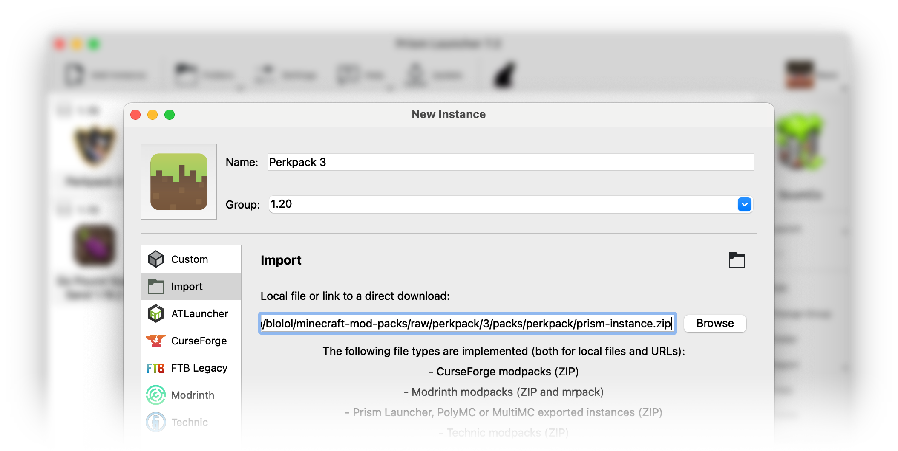

# Perkpack 3

Perkpack is Blolol's Minecraft mod pack, used for blocky shenanigans on our Minecraft server!

## Versions

Perkpack bumps its major version number for each significant Minecraft update (e.g. from Minecraft 1.18 to 1.19).

| Perkpack Version     | Minecraft Version |
|----------------------|-------------------|
| Perkpack 3 (current) | Minecraft 1.20    |
| Perkpack 2           | Minecraft 1.18    |
| Perkpack 1           | Minecraft 1.17    |

As described in ["How to play"](#how-to-play), below, the mod pack automatically keeps itself up to date once you've installed it. If you're interested in the changes between versions, you can find release notes here: https://github.com/blolol/minecraft-mod-packs/releases

Mod pack updates are also announced by Wheaties in the `#minecraft` channels of [Blolol's IRC and Discord servers](https://blolol.com/chat).

## How to play

Playing Perkpack is pretty simple stuff. You'll only need to install the mod pack once per significant Minecraft update (e.g. from Minecraft 1.19 to 1.20). It will otherwise automatically keep itself up to date.

1. Install [Java](https://prismlauncher.org/wiki/getting-started/installing-java/).
1. Install [Prism Launcher](https://prismlauncher.org).
1. In Prism Launcher, click "Add Instance", then "Import".
1. Give the instance a name like "Perkpack 3", then paste in this URL: https://github.com/blolol/minecraft-mod-packs/raw/perkpack/3/packs/perkpack/prism-instance.zip
1. Once you're in-game, connect to `mc.blolol.com`.



## Mods

### Create

Perkpack is built around [Create](https://modrinth.com/mod/create-fabric). Create adds a variety of blocks and tools with which you can build mechanical contraptions to automate and decorate your world—think conveyer belts, steam engines, mechanical presses, automated train networks, and much more.

<details>
  <summary>
    Click to expand more about Create
  </summary>

  To get an idea of what's possible with Create, check out its trailer:

  [](https://www.youtube.com/watch?v=rR8W-f9YhYA)

  Create features interactive, in-game documentation using a system called "Ponder". To try it out, open up your inventory and filter it to Create's blocks and items by typing `@create` into the search bar. Find a block or item with "Hold [w] to ponder" in its tooltip to view its animated tutorial:

  

  There's also [a well-maintained wiki](https://create.fandom.com/wiki/Create_Mod_Wiki) and lots of Create content on YouTube!
</details>

### Quality of life

* [AdvancementInfo](https://modrinth.com/mod/advancementinfo) (nicer advancements screen)
* [Amecs](https://modrinth.com/mod/amecs) (use modifier keys in your key bindings)
* [AutoRun](https://modrinth.com/mod/autorun) (use <kbd>`</kbd> to toggle autorun)
* [BetterF3](https://modrinth.com/mod/betterf3) (more readable <kbd>F3</kbd> debug overlay)
* [Better Mount HUD](https://modrinth.com/mod/better-mount-hud) (more useful HUD while riding)
* [Couplings](https://modrinth.com/mod/couplings) (simultaneously open adjacent doors)
* [EMI](https://modrinth.com/mod/emi) (item and recipe viewer)
* [Inspecio](https://modrinth.com/mod/inspecio) (fancy tooltips for maps, shulker boxes, etc.)
* [MiniHUD](https://www.curseforge.com/minecraft/mc-mods/minihud) (extremely customizable HUD)
* [Mouse Tweaks](https://modrinth.com/mod/mouse-tweaks) (nicer inventory management)
* [Ok Zoomer](https://modrinth.com/mod/ok-zoomer) (use <kbd>c</kbd> and your mouse wheel to zoom)
* [Symbol Chat](https://modrinth.com/mod/symbol-chat) (easy access to Unicode symbols when chatting, editing signs, and naming items with anvils)
* [WTHIT](https://modrinth.com/mod/wthit) (tells you what the hell you're looking at)
* [Yeetus Experimentus](https://modrinth.com/mod/yeetus-experimentus) (silences the experimental features warning when creating a new world)

### World generation

* [ChoiceTheorem's Overhauled Village](https://modrinth.com/mod/ct-overhaul-village) (more interesting villages)
* [Tectonic](https://modrinth.com/datapack/tectonic) (large-scale terrain)
* [Terralith](https://modrinth.com/mod/terralith) (new biomes)
* [Terrestria](https://modrinth.com/mod/terrestria) (new biomes)
* [Traverse](https://modrinth.com/mod/traverse) (new biomes)
* [YUNG's Better Desert Temples](https://modrinth.com/mod/yungs-better-desert-temples)
* [YUNG's Better Dungeons](https://modrinth.com/mod/yungs-better-dungeons)
* [YUNG's Better Jungle Temples](https://modrinth.com/mod/yungs-better-jungle-temples)
* [YUNG's Better Mineshafts](https://modrinth.com/mod/yungs-better-mineshafts)
* [YUNG's Better Nether Fortresses](https://modrinth.com/mod/yungs-better-nether-fortresses)
* [YUNG's Better Strongholds](https://modrinth.com/mod/yungs-better-strongholds)
* [YUNG's Better Witch Huts](https://modrinth.com/mod/yungs-better-witch-huts)

### Resource packs

* [Default Dark Mode](https://modrinth.com/resourcepack/default-dark-mode) (:new_moon_with_face:)
* [Fresh Animations](https://modrinth.com/resourcepack/fresh-animations) (fancy mob animations)

### Shaders

Perkpack includes support for third-party shader packs using the [Iris]() mod. To enable and configure shaders in-game, use the default <kbd>o</kbd> key, and use <kbd>k</kbd> to toggle shaders on and off.

The pack includes these shaders by default, but you can also [install your own](https://modrinth.com/shaders):

* [BSL](https://modrinth.com/shader/bsl-shaders)
* [Complementary Reimagined](https://modrinth.com/shader/complementary-reimagined)
* [Complementary Unbound](https://modrinth.com/shader/complementary-unbound)

### Performance, bug fixes, compatibility

Perkpack includes a set of optimization mods, based on [Fabulously Optimized](https://modrinth.com/modpack/fabulously-optimized), to increase base game performance, fix a variety of bugs present in the vanilla game, and provide compatibility with OptiFine resource packs.

<details>
  <summary>
    Click to expand list of performance mods
  </summary>

  * [Animatica](https://modrinth.com/mod/animatica)
  * [Borderless Mining](https://modrinth.com/mod/borderless-mining)
  * [Capes](https://modrinth.com/mod/capes)
  * [CIT Resewn](https://modrinth.com/mod/cit-resewn)
  * [Continuity](https://modrinth.com/mod/continuity)
  * [Debugify](https://modrinth.com/mod/debugify)
  * [Dynamic FPS](https://modrinth.com/mod/dynamic-fps)
  * [Enhanced Block Entities](https://modrinth.com/mod/ebe) (EBE)
  * [Entity Model Features](https://modrinth.com/mod/entity-model-features) (EMF)
  * [Entity Culling](https://modrinth.com/mod/entityculling)
  * [Entity Texture Features](https://modrinth.com/mod/entitytexturefeatures) (ETF)
  * [Fadeless](https://modrinth.com/mod/fadeless)
  * [FerriteCore](https://modrinth.com/mod/ferrite-core)
  * [ImmediatelyFast](https://modrinth.com/mod/immediatelyfast)
  * [Indium](https://modrinth.com/mod/indium)
  * [Iris](https://modrinth.com/mod/iris)
  * [Krypton](https://modrinth.com/mod/krypton)
  * [Lithium](https://modrinth.com/mod/lithium)
  * [Memory Leak Fix](https://modrinth.com/mod/memoryleakfix)
  * [Model Gap Fix](https://modrinth.com/mod/modelfix)
  * [ModernFix](https://modrinth.com/mod/modernfix)
  * [More Culling](https://modrinth.com/mod/moreculling)
  * [Reese's Sodium Options](https://modrinth.com/mod/reeses-sodium-options)
  * [Sodium Extra](https://modrinth.com/mod/sodium-extra)
  * [Sodium](https://modrinth.com/mod/sodium)
</details>

## Development

### Testing the pack

You can use [Docker Compose](https://docs.docker.com/compose/) to set up a local development environment. The included `docker-compose.yml` will:

* Start an HTTP server on port 8082 that will serve up `pack.toml` and other packwiz files.
* Start a Minecraft game server on port 25565 (the game's default) using those local pack files.

To start both servers, run `docker compose up` in this directory. Minecraft server data will be written into `tmp/server` and ignored by Git. The Docker Compose file includes defaults that will be written to `server.properties`. Once the file is generated, you can customize it.

To create a Prism Launcher instance that connects to your local HTTP server, import `prism-instance.zip` to create a new instance. Right-click on the instance and select Edit > Settings > Custom commands. Change the pre-launch command to point at your local server:

```sh
"$INST_JAVA" -jar packwiz-installer-bootstrap.jar http://localhost:8082/pack.toml
```

To learn how to contribute your changes to Perkpack, see [this repository's main README](../../README.md).

### Building `prism-instance.zip`

To build `prism-instance.zip`, run `make` in this directory. Use `make clean` to remove it.
