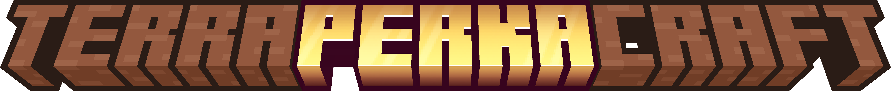

**TerraPerkaCraft** is Blolol's [TerraFirmaCraft](https://modrinth.com/mod/terrafirmacraft) (TFC) hardcore survival Minecraft mod pack, based on Minecraft 1.21.1 and the NeoForge mod loader.

TerraFirmaCraft is a total conversion mod that increases the depth and raises the difficulty of Minecraft's survival mode. Expect to spend much longer in the early game, collecting sticks and stones to [knap basic tools](https://terrafirmacraft.github.io/Field-Guide/en_us/getting_started/introduction.html), keeping your [campfire fueled](https://terrafirmacraft.github.io/Field-Guide/en_us/getting_started/firepit.html), and contending with [hunger, thirst](https://terrafirmacraft.github.io/Field-Guide/en_us/getting_started/food_and_water.html), [temperature and changing seasons](https://terrafirmacraft.github.io/Field-Guide/en_us/the_world/climate.html).

Game systems are explained using an in-game field guide (press <kbd>e</kbd> to view your inventory, then click the 📘 tab), which is also available online: https://terrafirmacraft.github.io/Field-Guide/en_us/

The TerraFirmaCraft base game is further expanded with [Firmalife](https://terrafirmacraft.github.io/Field-Guide/en_us/firmalife/)'s cooking and farming.

More information about Blolol's history with TerraFirmaCraft, and details about TerraPerkaCraft servers and worlds, can be found on Borkpaedia: https://wiki.blolol.com/TerraPerkaCraft

## How to play

It's just a few clicks to install the game launcher and the mod pack. Once you've installed it, TerraPerkaCraft will keep itself up to date each time you launch it.

1. Install [Prism Launcher](https://prismlauncher.org).
2. In Prism Launcher, click "Add Instance", then "Import".
3. Give the instance a name like "TerraPerkaCraft", then paste in this URL: https://github.com/blolol/minecraft-mod-packs/raw/main/packs/terraperkacraft/prism-instance.zip
4. Once you're in-game, connect to `tpc.mc.blolol.com` (`tfc.mc.blolol.com` also works).

### Tips and tricks

* **Borderless fullscreen:** You can switch to borderless fullscreen window mode in Main Menu > Options > Video Settings > General, and cycle Fullscreen Mode until it says "Borderless". If your Fullscreen Mode setting appears as a checkbox, open the vanilla game's video settings by pressing <kbd>Control + Shift + P</kbd> (or <kbd>Command + Shift + P</kbd> on a Mac), and you should be able to cycle the Fullscreen Mode button there.
* **Jade:** To toggle [Jade](https://modrinth.com/mod/jade)'s HUD at the top of your screen that displays details of what you're looking at in the world, press <kbd>1</kbd> on your keypad with the default key binds. To customize Jade's settings, go to Main Menu > Mods > Jade > Config.
* **Recipe viewer:** You can filter [Just Enough Items](https://modrinth.com/mod/jei)' item list by mod name. Open your inventory screen, press <kbd>Control + F</kbd> (or <kbd>Command + F</kbd> on a Mac) to focus the search input, and enter `@terra`, or any other fragment of a mod name prefixed with `@`, to filter the list of blocks and items to ones added by that mod. More advanced features are documented on [the mod's Modrinth page](https://modrinth.com/mod/jei).
* **Maps:** You decide what level of navigation difficulty you find most enjoyable. You can play without any maps at all (the default) or enable [Xaero's Minimap](https://modrinth.com/mod/xaeros-minimap) and/or [Xaero's World Map](https://modrinth.com/mod/xaeros-world-map) in Options > Controls > Key Binds. It's up to you!
* For tips about TerraFirmaCraft gameplay, check out [its Borkpaedia article](https://wiki.blolol.com/TerraPerkaCraft).

## Mods

* [TerraFirmaCraft](https://modrinth.com/mod/terrafirmacraft) ([field guide](https://terrafirmacraft.github.io/Field-Guide/en_us/))
* [Firmalife](https://modrinth.com/mod/firmalife) cooking and farming addon ([field guide](https://terrafirmacraft.github.io/Field-Guide/en_us/firmalife/))
* [ArborFirmaCraft](https://modrinth.com/mod/arborfirmacraft-(afc)) adds tree species that correspond with the vanilla Minecraft wood colors that are otherwise missing from TerraFirmaCraft
* [Caelum](https://modrinth.com/mod/caelum) adds a realistic night sky and celestial objects that you can use to navigate
* [GraveStone Mod](https://modrinth.com/mod/gravestone-mod) places a grave with your stuff when you die, so it doesn't despawn (its obituary feature is disabled, to prevent cheesing your location using the coordinates it shows)
* [Roads and Roofs](https://modrinth.com/mod/roads-and-roofs-tfc) provides an immersive road-building process and a movement speed boost on completed roads
* [Xaero's Minimap](https://modrinth.com/mod/xaeros-minimap) and [Xaero's World Map](https://modrinth.com/mod/xaeros-world-map)

### Quality of Life

* [Chat Heads](https://modrinth.com/mod/chat-heads) adds player heads next to chat messages
* [Cubes Without Borders](https://modrinth.com/mod/cubes-without-borders) adds borderless fullscreen support
* [Jade](https://modrinth.com/mod/jade) provides a small HUD at the top of your screen that displays the name of the block or entity you're looking at in the world
  * [TFC Support Indicator](https://modrinth.com/mod/tfc-support-indicator) adds an optional indicator to Jade's HUD about whether the block you're looking at is [supported against collapse](https://terrafirmacraft.github.io/Field-Guide/en_us/core_mechanics/support_beams.html).
* [Just Enough Items](https://modrinth.com/mod/jei) for more easily browsing and searching items and recipes in your inventory screen
* [Mouse Tweaks](https://modrinth.com/mod/mouse-tweaks) allows you to use your scroll wheel to move items between your inventory and containers
* [Quark](https://modrinth.com/mod/quark) adds an auto-walk keybind, inventory sorting and filtering, and a couple of other quality of life tweaks
* [RyoamicLights](https://modrinth.com/mod/ryoamiclights) adds dynamic lights (a torch held in your hand lights up the world around you)

### Ambience

* [AmbientSounds](https://modrinth.com/mod/ambientsounds)
* [Sound Physics Remastered](https://modrinth.com/mod/sound-physics-remastered)

### Performance

* [Distant Horizons](https://modrinth.com/mod/distanthorizons)
* [Embeddium](https://modrinth.com/mod/embeddium)
* [Embeddium Extra](https://modrinth.com/mod/rubidium-extra)
* [FerriteCore](https://modrinth.com/mod/ferrite-core)
* [ImmediatelyFast](https://modrinth.com/mod/immediatelyfast)
* [ModernFix](https://modrinth.com/mod/modernfix)
* [Radium](https://modrinth.com/mod/radium)

## Resource packs

TerraPerkaCraft comes with the [Vexxed Visuals](https://www.curseforge.com/minecraft/texture-packs/terrafirmacraft-vexxed-visuals) resource pack, which is a remaster of the default TerraFirmaCraft textures, enabled by default. If you'd like to play with the original textures, go to Main Menu > Options > Resource Packs, and disable Vexxed Visuals.
